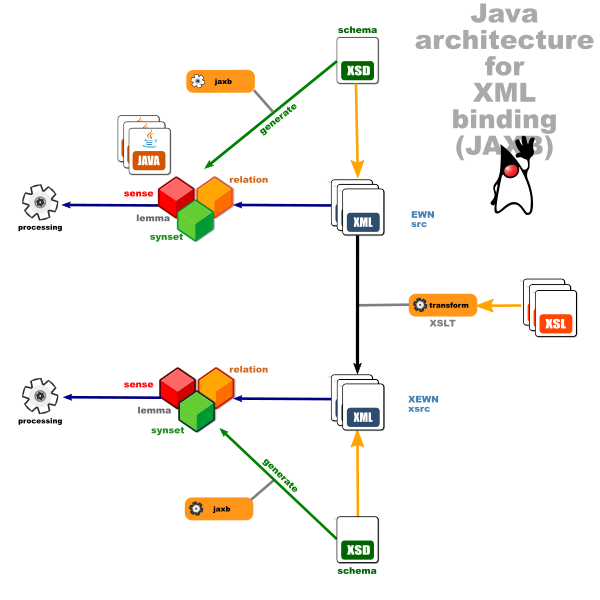

### Java Architecture for XML Binding (JAXB) for XEWN XML schema

Provides access to Xtended English Wordnet (XEWN) *src* files through Plain Old Java Object (Pojo) classes. The Java objects are generated from the XSD typed schema by the JAXB compiler, effectively **binding the objects to their XML** representation (or *unmarshalling* XML to Java objects).

It uses the **JAXB** framework which is is one of the APIs in the Jakarta EE platform (formerly called Java EE).

Please refer to the test classes in the source files to get a glimpse as to how it can be used.

